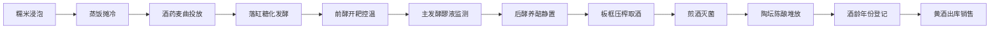

## 1. 产品概述

黄酒发酵酒厂Web管理系统是一款面向酿造主管的生产管理工具，用于管理黄酒酿造全流程，包括浸米、发酵和压榨等核心工序。系统覆盖从糯米浸泡到成品销售的完整产业链，帮助酿造主管实时监控生产状态、记录关键工艺参数、追溯批次信息，提升黄酒品质稳定性和生产效率。

## 2. 核心功能

### 2.1 用户角色
| 角色 | 登录方式 | 核心权限 |
|------|---------|---------|
| 酿造主管 | 账号密码登录 | 全流程管理、数据查看、操作记录、批次追溯 |

### 2.2 功能模块
1. **数据看板**：酿造流程总览、关键指标统计、批次进度追踪
2. **糯米浸泡**：糯米浸渍酸浆管理、浸泡时间记录、水质监测
3. **蒸饭落缸**：蒸饭摊冷记录、酒药麦曲投放、落缸糖化发酵
4. **前酵开耙**：开耙降温控温、主发酵醪液监测、温度曲线
5. **后酵养醅**：后酵养醅静置、醅液监测、陈化记录
6. **压榨煎酒**：板框压榨取酒、煎酒灭菌、出酒率统计
7. **陈酿装坛**：陶坛陈酿堆放、酒龄年份登记、坛位管理
8. **成品销售**：黄酒出库销售、库存管理、销售记录

### 2.3 页面详情
| 页面名称 | 模块名称 | 功能描述 |
|---------|---------|----------|
| 数据看板 | 总览仪表盘 | 生产进度概览、关键指标卡片、在制批次列表、近期活动记录 |
| 糯米浸泡 | 浸泡管理 | 浸泡批次列表、新建浸泡任务、酸浆监测、浸泡时间倒计时 |
| 蒸饭落缸 | 蒸饭管理 | 蒸饭记录、摊冷温度、酒药麦曲投加记录、落缸糖化进度 |
| 前酵开耙 | 发酵管理 | 开耙记录、温度监测曲线、醪液指标检测、发酵进度跟踪 |
| 后酵养醅 | 养醅管理 | 养醅批次列表、静置环境监测、醅液抽检记录 |
| 压榨煎酒 | 压榨管理 | 压榨批次、板框运行记录、煎酒灭菌参数、出酒率统计 |
| 陈酿装坛 | 陈酿管理 | 陶坛库存、酒龄登记、坛位分布图、陈化环境监测 |
| 成品销售 | 销售管理 | 成品库存、出库记录、销售台账、客户信息 |

## 3. 核心流程

黄酒酿造核心工艺流程：糯米浸泡 → 蒸饭摊冷 → 落缸糖化 → 前酵开耙 → 后酵养醅 → 压榨取酒 → 煎酒灭菌 → 陶坛陈酿 → 成品销售

## 4. 用户界面设计

### 4.1 设计风格
- **主色调**：深琥珀色（#8B4513）搭配陶土红（#CD853F），体现黄酒传统工艺的厚重感
- **辅助色**：米白色（#FAF0E6）背景，墨绿（#2F4F4F）数据强调色
- **按钮风格**：圆角矩形，微立体效果，琥珀色主按钮
- **字体**：标题使用衬线体（Source Serif Pro）体现传统质感，正文使用无衬线体（Noto Sans SC）保证可读性
- **布局风格**：侧边栏导航 + 顶部状态栏 + 卡片式内容区
- **图标风格**：线性图标，琥珀色主题，融入传统酿酒元素

### 4.2 页面设计总览
| 页面名称 | 模块名称 | UI元素 |
|---------|---------|--------|
| 数据看板 | 仪表盘 | 统计卡片、进度条、批次列表、时间线、图表 |
| 模块页面 | 列表/详情 | 数据表格、表单弹窗、状态标签、操作按钮、进度追踪 |

### 4.3 响应式
- 桌面端优先设计，侧边栏固定宽度
- 平板端侧边栏可收起，内容区自适应
- 移动端采用底部导航，卡片堆叠布局
- 触摸操作优化，确保按钮可点击区域足够

### 4.4 动效设计
- 页面切换采用淡入淡出过渡
- 数据卡片悬停时有微上浮和阴影加深效果
- 状态变化时采用平滑过渡动画
- 进度条和数据指标变化采用数字滚动动画
