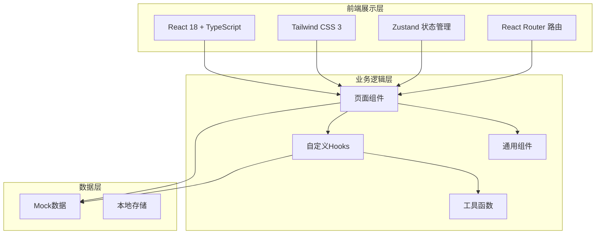
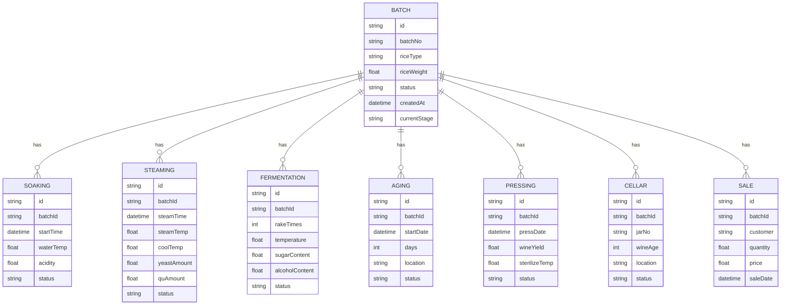

## 1. 架构设计



## 2. 技术描述

- **前端框架**：React 18 + TypeScript
- **构建工具**：Vite 5
- **样式方案**：Tailwind CSS 3
- **状态管理**：Zustand
- **路由管理**：React Router DOM 6
- **图标库**：Lucide React
- **图表库**：Recharts
- **数据方案**：Mock数据 + LocalStorage持久化
- **包管理器**：pnpm（优先）/ npm

## 3. 路由定义

| 路由路径 | 页面名称 | 说明 |
|---------|---------|------|
| /dashboard | 数据看板 | 酿造流程总览、关键指标统计 |
| /soaking | 糯米浸泡 | 糯米浸渍酸浆管理 |
| /steaming | 蒸饭落缸 | 蒸饭摊冷、酒药麦曲投放 |
| /fermentation | 前酵开耙 | 开耙降温控温、醪液监测 |
| /aging | 后酵养醅 | 后酵养醅静置管理 |
| /pressing | 压榨煎酒 | 板框压榨、煎酒灭菌 |
| /cellar | 陈酿装坛 | 陶坛陈酿、酒龄登记 |
| /sales | 成品销售 | 出库销售、库存管理 |

## 4. 数据模型

### 4.1 核心数据实体



### 4.2 批次状态枚举
- `soaking`: 浸泡中
- `steaming`: 蒸饭落缸
- `fermenting`: 前酵开耙
- `aging`: 后酵养醅
- `pressing`: 压榨煎酒
- `cellaring`: 陈酿装坛
- `finished`: 成品待售
- `sold`: 已销售

## 5. 项目结构

```
src/
├── components/        # 通用组件
│   ├── Layout/       # 布局组件
│   ├── StatusBadge/  # 状态标签
│   ├── StatCard/     # 统计卡片
│   └── BatchTable/   # 批次表格
├── pages/            # 页面组件
│   ├── Dashboard/
│   ├── Soaking/
│   ├── Steaming/
│   ├── Fermentation/
│   ├── Aging/
│   ├── Pressing/
│   ├── Cellar/
│   └── Sales/
├── hooks/            # 自定义Hooks
├── store/            # Zustand状态
├── utils/            # 工具函数
├── types/            # TypeScript类型
├── data/             # Mock数据
├── App.tsx
├── main.tsx
└── index.css
```

## 6. 状态管理设计

使用Zustand管理全局状态：
- `useBatchStore`: 批次数据管理（CRUD操作、状态流转）
- `useUIStore`: 界面状态（侧边栏展开/收起、当前选中模块）

状态持久化：使用localStorage保存生产数据，刷新页面不丢失。
